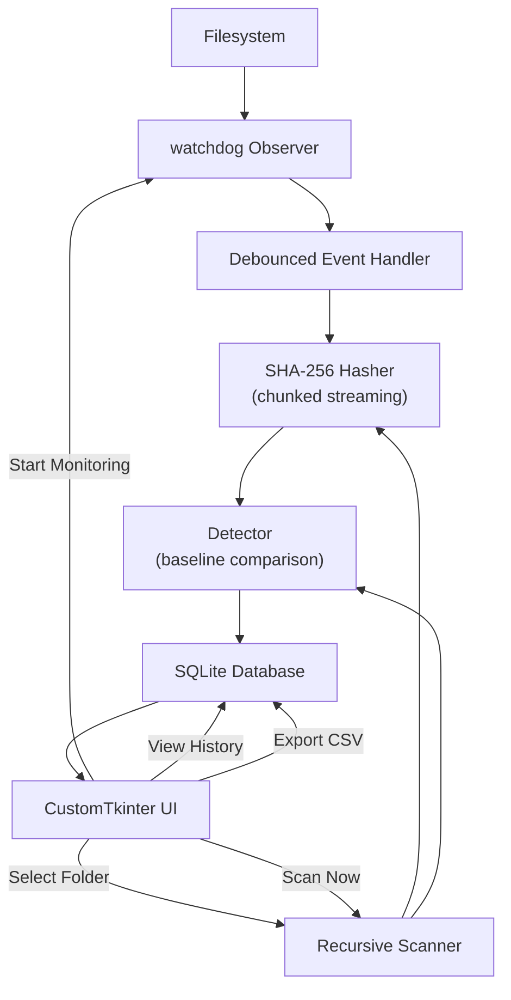

# 🔐 FileWatch

**Local File Integrity Monitoring System**

FileWatch monitors a selected folder and detects when files are added, modified, deleted, or renamed. It uses SHA-256 cryptographic hashing to fingerprint file contents and real-time filesystem monitoring to detect changes as they happen.

---

## Why This Exists

File integrity monitoring is a foundational concept in security and systems administration. If an attacker modifies a configuration file, or if a deployment unexpectedly changes a binary, a file integrity monitor detects it.

FileWatch implements this concept as a local desktop tool:

1. **Create a trusted baseline** — snapshot all files and their SHA-256 hashes.
2. **Monitor the folder** — detect filesystem events in real time.
3. **Compare fingerprints** — classify changes as added, modified, deleted, or renamed.
4. **Record history** — persist every detected change in a local SQLite database.

This is a **file integrity monitor**, not antivirus software. It reports file changes without making claims about whether a change is malicious. A modified file could be a legitimate edit, a software update, or an unauthorized modification — FileWatch reports the change and lets the user decide.

---

## Features

| Feature | Description |
|---|---|
| **SHA-256 fingerprinting** | Streaming chunked hashing (1 MB reads) — handles files of any size without loading them into memory |
| **Baseline snapshots** | Stores a trusted snapshot of all file hashes for later comparison |
| **Change detection** | Detects added, modified, deleted, and renamed files by comparing current state against the baseline |
| **Real-time monitoring** | Uses `watchdog` to detect filesystem events as they happen, with debouncing to suppress OS-level duplicate events |
| **SQLite audit history** | Every detected change is recorded with timestamp, event type, file path, and SHA-256 hashes |
| **Filtering & search** | Filter history by event type (Added / Modified / Deleted / Renamed) and search by filename |
| **CSV export** | Export the full change history for external analysis |
| **Configurable ignore rules** | Skip directories like `.git`, `node_modules`, `__pycache__` — user-configurable |
| **Dark desktop UI** | Professional CustomTkinter interface with tab navigation, progress tracking, and toast notifications |
| **Thread-safe design** | All scanning and hashing runs in background threads — the UI never freezes |

---

## How It Works

```
SELECT FOLDER → SCAN FILES → SHA-256 HASH → CREATE BASELINE
                                                    ↓
                                            MONITOR FOLDER
                                                    ↓
                                           FILE EVENT OCCURS
                                                    ↓
                                          HASH & COMPARE → CLASSIFY CHANGE
                                                    ↓
                                         SAVE TO SQLITE → SHOW IN UI
```

**Example:** You create a baseline of a project folder containing `app.py`, `config.json`, and `README.md`. Later:

- `app.py` content changes → **MODIFIED** (SHA-256 hashes differ)
- `test.py` appears → **ADDED** (not in baseline)
- `config.json` disappears → **DELETED** (in baseline but not on disk)
- `README.md` renamed to `DOCS.md` with same content → **RENAMED** (same hash, different path)

---

## Architecture



### Project Structure

```
FileWatch/
├── app.py                      # Entry point, AppController, main window
├── core/
│   ├── hasher.py               # SHA-256 streaming file hasher
│   ├── scanner.py              # Recursive directory scanner with progress
│   ├── baseline.py             # Baseline creation and retrieval
│   ├── detector.py             # Change classification (add/modify/delete/rename)
│   └── monitor.py              # Watchdog real-time monitor with debouncing
├── database/
│   └── db.py                   # SQLite storage (baselines, files, events)
├── ui/
│   ├── components.py           # Design system and reusable widgets
│   ├── dashboard.py            # Main dashboard panel
│   ├── history.py              # Filterable/searchable event history
│   └── settings.py             # Settings and configuration panel
├── utils/
│   ├── config.py               # JSON-backed application settings
│   └── file_utils.py           # Formatting helpers (sizes, timestamps)
├── tests/
│   └── test_integration.py     # Integration test suite (58 tests)
├── requirements.txt
├── .gitignore
└── README.md
```

---

## Tech Stack

| Component | Technology |
|---|---|
| Language | Python 3.11+ |
| GUI | CustomTkinter |
| Hashing | `hashlib` (SHA-256) |
| Filesystem monitoring | `watchdog` |
| Database | SQLite3 (stdlib) |
| Filesystem operations | `pathlib`, `os` |
| Concurrency | `threading` |
| Configuration | `json` (stdlib) |
| CSV export | `csv` (stdlib) |

No web server. No cloud services. No internet connection required. Everything runs locally.

---

## Installation

### Prerequisites

- Python 3.11 or later

### Setup

```bash
# Clone the repository
git clone https://github.com/YOUR_USERNAME/FileWatch.git
cd FileWatch

# Create and activate a virtual environment
python -m venv .venv

# Windows
.venv\Scripts\activate

# macOS / Linux
source .venv/bin/activate

# Install dependencies
pip install -r requirements.txt
```

---

## Usage

### Run the application

```bash
python app.py
```

### Workflow

1. **Select Folder** — click "Select Folder" and choose a directory to monitor.
2. **Create Baseline** — click "Create Baseline" to scan all files and store their SHA-256 fingerprints.
3. **Monitor** — real-time monitoring starts automatically (configurable in Settings). Click "Stop Monitoring" / "Start Monitoring" to toggle.
4. **Scan Now** — click "Scan Now" at any time to run a full comparison against the baseline.
5. **View History** — switch to the History tab to browse, filter, and search change events.
6. **Export** — go to Settings and click "Export History (CSV)" to save the audit log.

---

## Running Tests

```bash
# Set encoding for Unicode test output on Windows
# PowerShell:
$env:PYTHONIOENCODING='utf-8'; python -m tests.test_integration

# Bash:
PYTHONIOENCODING=utf-8 python -m tests.test_integration
```

The test suite covers 58 assertions across 15 categories:

| # | Category | What it tests |
|---|---|---|
| 1 | SHA-256 Hashing | Correct hashes, identical content → identical hash, missing file handling |
| 2 | File Scanner | Recursive walk, progress callbacks, ignored folders |
| 3 | Database | Baseline CRUD, event storage, filtering, search, today count |
| 4 | No Changes | Scan with no modifications returns 0 changes |
| 5 | Modified | Content change detected with differing hashes |
| 6 | Added | New file detected |
| 7 | Deleted | Removed file detected |
| 8 | Renamed | Same-hash rename detection (or fallback to delete+add) |
| 9 | AppController | End-to-end through the controller layer |
| 10 | Real-Time Monitoring | Watchdog detects live filesystem changes |
| 11 | Persistence | Baseline and history survive app restart |
| 12 | CSV Export | Valid CSV with correct headers |
| 13 | Search & Filter | Event type filtering and filename search |
| 14 | Utility Functions | Size formatting, timestamp formatting |
| 15 | Edge Cases | Empty folders, default config values |

---

## Example Workflow

```
# 1. Start FileWatch
python app.py

# 2. Select folder: C:\Projects\MyApp
# 3. Click "Create Baseline"
#    → 247 files scanned, baseline created

# 4. Make changes externally:
#    - Edit src/app.py
#    - Create tests/new_test.py
#    - Delete old_config.json

# 5. Click "Scan Now" (or let real-time monitoring detect it)
#    → 3 changes detected:
#      ✏️  MODIFIED  src/app.py
#      ➕  ADDED     tests/new_test.py
#      🗑️  DELETED   old_config.json

# 6. Click any change to see full details:
#    Previous SHA-256: a7c3f8d1e5...
#    Current SHA-256:  9bf81a44c2...
#    Detected: August 11, 2026 21:44:05
```

---

## Security Considerations

- **SHA-256 detects content changes** — if a file's contents are modified, the hash will differ from the baseline. This is the core mechanism.
- **SHA-256 does not protect the baseline itself** — the baseline database (`filewatch.db`) is a local SQLite file. An attacker with write access to the database could tamper with stored hashes. In a production security context, the baseline should be stored on a separate, protected medium.
- **This is not antivirus software** — FileWatch detects that a file changed, not whether the change is malicious. A modified file could be a legitimate user edit, a software update, or an unauthorized modification.
- **All SQL queries use parameterized placeholders** (`?`) — no string concatenation is used for query construction.
- **No network access** — FileWatch runs entirely offline. No data leaves the machine.

---

## Known Limitations

- **Content diff**: FileWatch detects *that* a file changed, not *what* changed within it (no line-by-line diff).
- **Rename detection**: Renames are detected by matching deleted + added files with identical SHA-256 hashes. If a file is renamed *and* modified simultaneously, it appears as a separate deletion and addition.
- **Symlinks**: Symbolic links are followed but not specially tracked.
- **Network drives**: Performance may vary on network-mounted filesystems due to watchdog limitations.
- **Very large directories**: Initial baseline creation for directories with hundreds of thousands of files may take several minutes (progress is displayed).

---

## Future Improvements

- Scheduled automatic scans (e.g., hourly baseline comparison)
- Baseline export/import for offline verification
- File change notifications via system tray

---

## Resume

**FileWatch — File Integrity Monitoring System**

> Built a Python desktop application for local file integrity monitoring using SHA-256 cryptographic hashing and real-time filesystem event detection. Implemented streaming chunked hashing, baseline snapshot comparison, and change classification (added/modified/deleted/renamed) with debounced watchdog monitoring. Designed a thread-safe architecture with background scanning, SQLite audit persistence, and a professional dark-mode CustomTkinter interface. Verified with 58 automated integration tests covering core detection, real-time monitoring, persistence, and edge cases.

---

## License

MIT
